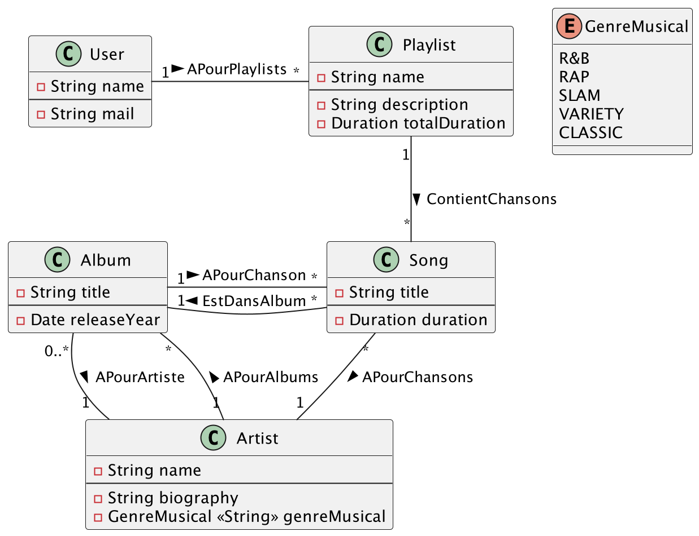
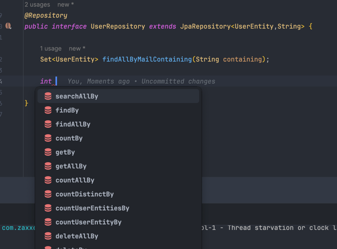

# <u>L3 Miage - BDD -TP3 - EXO 1</u>

* Pour pouvoir démarrer tous les TPs simplement, assurez-vous d'avoir tous les prérequis :
    * voir les [prérequis](prerequis.md)

# Objectif de l'exercice :

Dans cet exercice, vous allez apprendre à :

* Créer et utiliser des repositories.

# Le modèle applicatif

* Dans cet exercice, nous allons être tout le long dans le paradigme `create`
* Voici la situation qui est déjà implémentée :
  


## 1. Creation des repository.

### Exemple

Nous allons dans cet exemple faire le repository de l'entité `UserEntity`

#### Création de l'interface Repositories

1. Créez un package `repositories` dans le package `fr.uga.l3miage.tp3.exo1`
2. Créez l'interface `UserRepository` de cette manière :
```java
public interface UserRepository{
}
```
3. Faites étendre cette interface de l'interface `JPARepositroy<T,ID>`, T étant le type d'entité, et ID le type de l'id dans l'entité (l'attribut qui porte le `@Id`)
```java
public interface UserRepository extends JpaRepository<UserEntity,String> {
}
```
4. Ajoutez l'annotation `@Repository` sur l'interface (`@Repository` étant un alias d'annotation pour l'annotation `@Component`)
```java
@Repository
public interface UserRepository extends JpaRepository<UserEntity,String> {
}
```
Vous avez maintenant un repository fonctionnel qui vous propose des fonctions de base.

#### Utilisation du Repository

1. Créez un package `components` dans le package `fr.uga.l3miage.tp3.exo1`
2. Créez la classe `UserComponent`:
```java
public class UserComponent {
}
```
3. Ajoutez l'annotation `@Component` afin de pouvoir créer un `beans` de ce composant (dans l'architecture hexagonale, nous sommes dans la partie `data`)
```java
@Component
public class UserComponent {
}
```
4. Déclarez l'attribut `UserRepository` dans la classe
```java
@Component
public class UserComponent {
    private final UserRepository userRepository;
}
```
5. Comme vu en cours, il faudra que ce repository soit injecté par spring. Pour permettre cela nous allons faire une injection par constructeur via `Lombok`.
   Ajoutez donc l'annotation `@RequiredArgsConstructor`, qui permet de générer à la compilation un constructeur qui contient tous les champs `private final`
```java
@Component
@RequiredArgsConstructor
public class UserComponent {
    private final UserRepository userRepository;
}
```

6. Maintenant, nous allons créer un comportement `CRUD`(create, read, update, delete).

##### Read

1. Créez la fonction suivante, qui nous permet de récupérer un user en fonction de son nom :
```java
@Component
@RequiredArgsConstructor
public class UserComponent {
  private final UserRepository userRepository;

  public UserEntity getUser(String name){
  }
}
```
2. Utilisez la fonction de base d'un repository `findById` :
```java
//...Before
public UserEntity getUser(String name){
  return userRepository.findById(name).orElseThrow();
}
//...after
```
Ici, vous venez de permettre la lecture d'une entité user en base grâce à son id.

##### Create

Avant de pouvoir créer une entité `user`, nous allons ajouter quelques annotations à l'entité afin de l'utiliser dans les meilleures conditions.

1. Dans l'entité `UserEntity` ajoutez l'annotation `@Setter` et `@Getter` qui permettent de générer à la compilation tous les setters et tous les getters de la classe
```java
@Entity
@Setter
@Getter
public class UserEntity {
    //attribut
}
```
2. Dans l'entité `UserEntity` ajoutez l'annotation `@Builder` qui permet la création d'un builder(voir le [patron builder](https://refactoring.guru/fr/design-patterns/builder)). Cependant, si vous n'ajoutez que cette annotation, vous allez avoir une erreur, vous devez donc utiliser les annotations `@NoArgsConstructor`, qui va générer un constructeur sans paramètres, et l'annotation `@AllArgsConstructor` qui génère un constructeur avec tous les attributs de la classe en paramètres.
```java
@Entity
@Builder
@NoArgsConstructor
@AllArgsConstructor
@Setter
@Getter
public class UserEntity {
    //attributs
}
```
3. Créez une fonction qui va vous permettre de créer un user en base avec ce prototype :
```java
public UserEntity createUser(){
}
```
4. Créez une entité `UserEntity` en utilisant le builder :
```java
public UserEntity createUser(){
  UserEntity userEntity = UserEntity
          .builder()
          .mail("user@user.com")
          .name("user")
          .playlistEntities(Set.of())
          .build();
}
```
5. Enfin pour pouvoir l'enregistrer en base de données, vous allez appeler la fonction `save` du repository :
```java
public UserEntity createUser(){
        UserEntity userEntity = UserEntity
                .builder()
                .mail("user@user.com")
                .name("user")
                .playlistEntities(Set.of())
                .build();
        return userRepository.save(userEntity);
    }
```
Ici, vous venez donc de créer une entité user en base de données.

##### Update

Le principe de mise à jour en `Patch` est de récupérer l'entité en base, de la modifier, puis de l'enregistrer.
1. Créez une fonction avec ce prototype :
```java
public UserEntity updateEmail(String name, String newMail){
}
```

2. Récupérez l'entité à modifier en base
```java
 public UserEntity updateEmail(String name, String newMail){
        UserEntity userEntity = userRepository.findById(name).orElseThrow();
    }
```

3. Modifiez le mail de l'utilisateur
```java
public UserEntity updateEmail(String name,String newMail) {
    UserEntity userEntity = userRepository.findById(name).orElseThrow();
    userEntity.setMail(newMail);
}
```

4. Sauvegardez la modification en base en applicant la fonction `save`
```java
public UserEntity updateEmail(String name,String newMail){
        UserEntity userEntity = userRepository.findById(name).orElseThrow();
        userEntity.setMail(newMail);
        return userRepository.save(userEntity);
}
```

##### Delete

1. Créez la fonction avec ce prototype
```java
 public void deleteUser(String name){}
```

2. Appelez la fonction de base du repository `deleteById` pour supprimer en base de données l'utilisateur
```java
    public void deleteUser(String name){
        userRepository.deleteById(name);
    }
```
#### Ajout de fonction dans le repository

On peut imaginer que dans notre situation, nous voudrions récupérer tous les utilisateurs qui sont sous le domaine `Google` (avoir une adresse mail avec `@gmail.com`).

Comme vu en cours, nous allons donc créer une requête particulière par <u><b><i>interpolation de nom de fonction</i></u></b>.

1. Nous allons ajouter une fonction qui nous permet de récupérer tous les utilisateurs qui ont dans leur adresse mail `@gmail`. Décomposons pas à pas.

##### Le type de retour

Dans un premier temps, il faut voir le type de retour de notre fonction.
Dans notre cas, nous voulons plusieurs utilisateurs à la fois, et nous ne voulons pas avoir de doublons.

* Dans notre cas il nous faut donc un `Set<UserEntity>`

##### La granularité

Nous voulons chercher **tous les éléments** : nous allons utiliser la base `findAllBy`

##### Element de recherche

Dans notre cas, nous recherchons si l'email contient une information, donc `MailContaining`

##### Avec tout l'ensemble

En assemblant toutes les informations précédentes, nous créons la fonction suivante :

```java
Set<UserEntity> findAllByMailContaining(String containing);
```

##### Utilisation de cette fonction

1. Créez une fonction avec ce prototype dans le `UserComponent`
```java
public Set<UserEntity> getUserIsInDomain(String domaine){}
```
2. Appelez la fonction que vous avez créée directement
```java
public Set<UserEntity> getUserIsInDomain(String domaine){
        return userRepository.findAllByMailContaining(domaine);
}
```
Bravo, vous avez créé votre requête par interpolation de nom de fonctions


⚠️ Pensez-y, votre auto-completion sur intellij (raccourci : `ctrl+space`) vous propose directement les mots clés possibles de cette manière :


### A votre tour

1. Créez les repositories de toutes les autres entités
2. Créez tous les components pour faire à minima des `CRUD`
3. Créez des fonctions particulières (component, repository) :
    1. Récupérez une chanson dont la durée est comprise dans un interval donné
    2. Récupérez le nombre d'artistes en fonction de leur genre musical.
    3. Récupérez toutes les playlists, sans doublons qui ont une chanson particulière


### Questions

1. Avez-vous remarqué quelque-chose avec les fonctions par interpolation ?
2. A votre avis, quelle est la manière la plus efficace pour récupérer et mettre en relation plusieurs éléments entre eux ?
3. Ici, Les components renvoient directement les entités, pensez-vous que cela soit une bonne chose ? Sinon, quelle serait la bonne méthode ?
4. Si je supprime un artiste, que se passe-t-il ?
5. Si je récupère une playlist, est-ce que toute l'entité est chargée ?
---
# <div style="text-align: center;">Fin de l'exo 1</div>